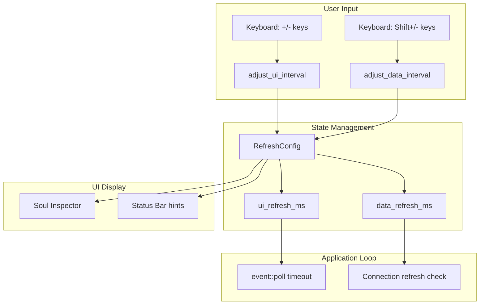

# Design Document: Configurable Refresh Intervals

## Overview

This feature adds runtime-configurable refresh intervals for UI rendering and data collection. Users can adjust these rates using keyboard shortcuts to balance between responsiveness and resource usage.

Core components:
1. **RefreshConfig struct**: Stores current interval settings
2. **Interval adjustment methods**: Handle user input to change rates
3. **UI display**: Show current settings in Soul Inspector
4. **Status bar updates**: Add keyboard hints for interval controls

## Architecture



## Components and Interfaces

### 1. RefreshConfig struct (src/app.rs)

```rust
/// Configuration for refresh intervals
#[derive(Debug, Clone)]
pub struct RefreshConfig {
    /// UI refresh interval in milliseconds (50-1000ms)
    pub ui_refresh_ms: u64,
    
    /// Data collection interval in milliseconds (500-5000ms)
    pub data_refresh_ms: u64,
    
    /// Timestamp of last interval change (for visual feedback)
    pub last_change: Option<Instant>,
}

impl RefreshConfig {
    pub fn new() -> Self {
        Self {
            ui_refresh_ms: 100,
            data_refresh_ms: 1000,
            last_change: None,
        }
    }
    
    /// Get UI refresh interval as Duration
    pub fn ui_interval(&self) -> Duration {
        Duration::from_millis(self.ui_refresh_ms)
    }
    
    /// Get data refresh interval as Duration
    pub fn data_interval(&self) -> Duration {
        Duration::from_millis(self.data_refresh_ms)
    }
}
```

### 2. AppState extension (src/app.rs)

```rust
pub struct AppState {
    // Existing fields...
    
    /// Refresh interval configuration
    pub refresh_config: RefreshConfig,
}

impl AppState {
    /// Increase UI refresh rate (decrease interval)
    pub fn increase_ui_refresh_rate(&mut self);
    
    /// Decrease UI refresh rate (increase interval)
    pub fn decrease_ui_refresh_rate(&mut self);
    
    /// Increase data collection rate (decrease interval)
    pub fn increase_data_refresh_rate(&mut self);
    
    /// Decrease data collection rate (increase interval)
    pub fn decrease_data_refresh_rate(&mut self);
}
```

### 3. Main loop changes (src/main.rs)

```rust
fn run_app<B: Backend>(terminal: &mut Terminal<B>) -> Result<()> {
    let mut app = AppState::new();

    loop {
        app.on_tick();
        terminal.draw(|f| ui::draw(f, &app))?;
        
        if !app.running {
            return Ok(());
        }

        // Use dynamic tick rate from config
        let tick_rate = app.refresh_config.ui_interval();
        
        if event::poll(tick_rate)? {
            if let Event::Key(key) = event::read()? {
                handle_key_event(&mut app, key);
            }
        }
    }
}
```

### 4. UI display (src/ui.rs)

Add to Soul Inspector panel:
```rust
// Display refresh intervals
let refresh_info = vec![
    Line::from(vec![
        Span::styled("UI Refresh: ", Style::default().fg(BONE_WHITE)),
        Span::styled(
            format!("{}ms", app.refresh_config.ui_refresh_ms),
            get_refresh_color(app.refresh_config.ui_refresh_ms, 100)
        ),
    ]),
    Line::from(vec![
        Span::styled("Data Refresh: ", Style::default().fg(BONE_WHITE)),
        Span::styled(
            format!("{}ms", app.refresh_config.data_refresh_ms),
            get_refresh_color(app.refresh_config.data_refresh_ms, 1000)
        ),
    ]),
];
```

## Data Models

### RefreshConfig

| Field | Type | Description | Range |
|-------|------|-------------|-------|
| ui_refresh_ms | u64 | UI refresh interval in milliseconds | 50-1000 |
| data_refresh_ms | u64 | Data collection interval in milliseconds | 500-5000 |
| last_change | Option<Instant> | Timestamp of last change for visual feedback | - |

### Constants

```rust
// UI refresh interval bounds
const MIN_UI_REFRESH_MS: u64 = 50;
const MAX_UI_REFRESH_MS: u64 = 1000;
const UI_REFRESH_STEP: u64 = 50;

// Data refresh interval bounds
const MIN_DATA_REFRESH_MS: u64 = 500;
const MAX_DATA_REFRESH_MS: u64 = 5000;
const DATA_REFRESH_STEP: u64 = 500;

// Visual feedback duration
const CHANGE_HIGHLIGHT_DURATION: Duration = Duration::from_millis(500);
```

## Correctness Properties

*A property is a characteristic or behavior that should hold true across all valid executions of a system-essentially, a formal statement about what the system should do. Properties serve as the bridge between human-readable specifications and machine-verifiable correctness guarantees.*

### Property 1: UI refresh interval bounds
*For any* sequence of increase/decrease operations on UI refresh rate, the resulting ui_refresh_ms value SHALL always be within the range [50, 1000] milliseconds.
**Validates: Requirements 1.4, 1.5**

### Property 2: Data refresh interval bounds
*For any* sequence of increase/decrease operations on data refresh rate, the resulting data_refresh_ms value SHALL always be within the range [500, 5000] milliseconds.
**Validates: Requirements 2.4, 2.5**

### Property 3: Interval adjustment consistency
*For any* valid interval value, calling increase then decrease (or decrease then increase) SHALL return to the original value, unless a boundary is reached.
**Validates: Requirements 1.2, 1.3, 2.2, 2.3**

### Property 4: Duration conversion accuracy
*For any* refresh config, the Duration returned by ui_interval() SHALL equal Duration::from_millis(ui_refresh_ms), and data_interval() SHALL equal Duration::from_millis(data_refresh_ms).
**Validates: Requirements 6.1, 6.2**

## Error Handling

### Interval adjustment

| Situation | Handling |
|-----------|----------|
| Attempt to decrease below minimum | Clamp to minimum value, no error |
| Attempt to increase above maximum | Clamp to maximum value, no error |
| Invalid interval value | Use default value (100ms for UI, 1000ms for data) |

### UI display

| Situation | Handling |
|-----------|----------|
| Terminal too narrow for all hints | Truncate or hide less important hints |
| Refresh config not initialized | Use default values |

## Testing Strategy

### Dual Testing Approach

This feature uses both unit tests and property-based tests:
- **Unit tests**: Verify specific boundary cases and state transitions
- **Property-based tests**: Verify interval bounds hold across all operations

### Property-Based Testing

**Library**: `proptest` (Rust PBT library)

**Configuration**: Each property test runs a minimum of 100 iterations

**Test tag format**: `**Feature: configurable-refresh, Property {number}: {property_text}**`

### Test Cases

#### Unit Tests

1. **Interval adjustment tests**
   - Verify increase/decrease operations change values by correct step
   - Verify clamping at minimum and maximum bounds
   - Verify default values on initialization

2. **Duration conversion tests**
   - Verify ui_interval() returns correct Duration
   - Verify data_interval() returns correct Duration

3. **Visual feedback tests**
   - Verify last_change timestamp is updated on adjustment
   - Verify color coding based on interval values

#### Property-Based Tests

1. **Property 1 test**: Verify UI interval always within bounds
2. **Property 2 test**: Verify data interval always within bounds
3. **Property 3 test**: Verify increase/decrease symmetry
4. **Property 4 test**: Verify Duration conversion accuracy

## Performance Considerations

### CPU Usage

- Lower UI refresh intervals (faster refresh) increase CPU usage
- Lower data collection intervals increase system call overhead
- Default values (100ms UI, 1000ms data) provide good balance

### Responsiveness

- UI refresh interval affects animation smoothness and input responsiveness
- Data collection interval affects how quickly new connections appear
- Minimum intervals ensure system remains responsive even at highest rates

### Resource Impact

| UI Interval | CPU Impact | Smoothness |
|-------------|------------|------------|
| 50ms | High | Very smooth |
| 100ms (default) | Medium | Smooth |
| 500ms | Low | Acceptable |
| 1000ms | Very low | Choppy |

| Data Interval | System Call Overhead | Update Latency |
|---------------|---------------------|----------------|
| 500ms | High | Very responsive |
| 1000ms (default) | Medium | Responsive |
| 2000ms | Low | Acceptable |
| 5000ms | Very low | Slow |
