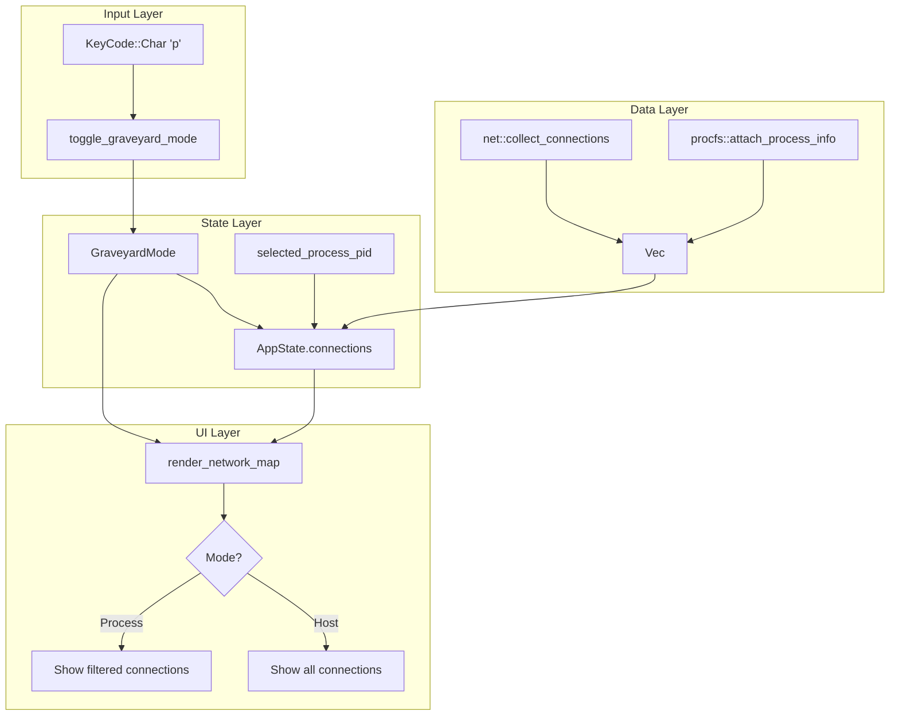

# Design Document: Process Focus Feature

## Overview

This feature adds process focus mode to ntomb's Graveyard network map. Users can select a specific process to visualize only that process's network connections.

Core components:
1. **Connection extension**: Add pid, process_name fields
2. **procfs module**: Linux /proc-based process mapping
3. **GraveyardMode**: Host/Process mode state management
4. **UI updates**: Mode-specific rendering and key bindings

## Architecture



## Components and Interfaces

### 1. Connection struct extension (src/net/mod.rs)

```rust
#[derive(Debug, Clone)]
pub struct Connection {
    pub local_addr: String,
    pub local_port: u16,
    pub remote_addr: String,
    pub remote_port: u16,
    pub state: ConnectionState,
    pub inode: Option<u64>,
    // Newly added
    pub pid: Option<i32>,
    pub process_name: Option<String>,
}
```

### 2. procfs module (src/procfs/mod.rs)

Linux-specific process mapping module:

```rust
/// Map process information to Connections using /proc on Linux
/// No-op on non-Linux systems
pub fn attach_process_info(conns: &mut [Connection]) -> std::io::Result<()>

/// Extract socket inodes from /proc/<pid>/fd/*
fn build_inode_pid_map() -> HashMap<u64, (i32, String)>

/// Read process name from /proc/<pid>/comm
fn read_process_name(pid: i32) -> Option<String>
```

### 3. GraveyardMode enum (src/app.rs)

```rust
#[derive(Debug, Clone, Copy, PartialEq, Eq, Default)]
pub enum GraveyardMode {
    #[default]
    Host,    // Host-wide view
    Process, // Selected process view
}
```

### 4. AppState extension (src/app.rs)

```rust
pub struct AppState {
    // Existing fields...
    
    /// Graveyard view mode
    pub graveyard_mode: GraveyardMode,
    
    /// Selected process PID in Process mode
    pub selected_process_pid: Option<i32>,
    
    /// Currently selected connection index (Active Connections list)
    pub selected_connection: Option<usize>,
}

impl AppState {
    /// Focus on the process of the selected connection
    pub fn focus_process_of_selected_connection(&mut self);
    
    /// Clear process focus, return to Host mode
    pub fn clear_process_focus(&mut self);
    
    /// Toggle focus based on current mode
    pub fn toggle_graveyard_mode(&mut self);
}
```

### 5. UI rendering changes (src/ui.rs)

```rust
/// Render network map (use different data based on mode)
fn render_network_map(f: &mut Frame, area: Rect, app: &AppState) {
    let connections = match app.graveyard_mode {
        GraveyardMode::Host => &app.connections,
        GraveyardMode::Process => filter_by_pid(&app.connections, app.selected_process_pid),
    };
    // ... rendering logic
}

/// Generate center node label
fn get_center_label(app: &AppState) -> String {
    match app.graveyard_mode {
        GraveyardMode::Host => "HOST".to_string(),
        GraveyardMode::Process => format!("PROC: {} ({})", name, pid),
    }
}
```

## Data Models

### Connection (extended)

| Field | Type | Description |
|-------|------|-------------|
| local_addr | String | Local IP address |
| local_port | u16 | Local port |
| remote_addr | String | Remote IP address |
| remote_port | u16 | Remote port |
| state | ConnectionState | TCP connection state |
| inode | Option<u64> | Socket inode (Linux) |
| pid | Option<i32> | Owning process PID |
| process_name | Option<String> | Process name |

### InodePidEntry (internal)

| Field | Type | Description |
|-------|------|-------------|
| inode | u64 | Socket inode |
| pid | i32 | Process ID |
| name | String | Process name |

## Correctness Properties

*A property is a characteristic or behavior that should hold true across all valid executions of a system-essentially, a formal statement about what the system should do. Properties serve as the bridge between human-readable specifications and machine-verifiable correctness guarantees.*

### Property 1: Connection initialization consistency
*For any* Connection returned by collect_connections(), the pid field SHALL be None and the process_name field SHALL be None.
**Validates: Requirements 1.1, 1.2**

### Property 2: Process mapping integrity
*For any* Connection with a valid inode that matches an entry in the inode-pid map, after attach_process_info() is called, the Connection's pid and process_name fields SHALL be populated with the corresponding values from the map.
**Validates: Requirements 2.2, 2.4**

### Property 3: Mode toggle consistency
*For any* AppState, calling toggle_graveyard_mode() when in Host mode with a valid selected connection SHALL result in Process mode, and calling it again SHALL return to Host mode with selected_process_pid reset to None.
**Validates: Requirements 4.2, 4.3**

### Property 4: Process filtering accuracy
*For any* set of connections and a selected pid, filtering connections by that pid SHALL return only connections where conn.pid == Some(selected_pid).
**Validates: Requirements 5.2**

### Property 5: Connection display formatting
*For any* Connection, the display format SHALL include "[<process_name>(<pid>)]" suffix if and only if both pid and process_name are Some.
**Validates: Requirements 6.1, 6.2**

### Property 6: Center node label accuracy
*For any* AppState in Process mode with selected_process_pid = Some(pid), the center label SHALL contain the pid value and the corresponding process name.
**Validates: Requirements 5.1**

## Error Handling

### procfs module error handling

| Situation | Handling |
|------|----------|
| /proc directory missing (non-Linux) | Return Ok(()), no operations performed |
| /proc/<pid>/fd read permission denied | Skip that pid and continue |
| /proc/<pid>/comm read failure | Set process_name to "unknown" |
| readlink failure | Skip that fd and continue |
| inode parsing failure | Skip that entry and continue |

### UI error handling

| Situation | Handling |
|------|----------|
| Process mode but no pid info | Behave like Host mode |
| Selected process has 0 connections | Display "(no active connections)" message |
| selected_connection out of range | Ignore focus attempt |

## Testing Strategy

### Dual Testing Approach

This feature uses both unit tests and property-based tests:
- **Unit tests**: Verify specific examples and edge cases
- **Property-based tests**: Verify properties that should hold for all inputs

### Property-Based Testing

**Library**: `proptest` (Rust PBT library)

**Configuration**: Each property test runs a minimum of 100 iterations

**Test tag format**: `**Feature: process-focus, Property {number}: {property_text}**`

### Test Cases

#### Unit Tests

1. **Connection field tests**
   - Verify pid, process_name fields exist when creating Connection
   - Verify collect_connections() results have pid, process_name as None

2. **GraveyardMode tests**
   - Verify default value is Host
   - Verify toggle behavior

3. **procfs module tests** (Linux only)
   - Verify Ok(()) returned when /proc missing
   - Verify graceful handling of permission errors

4. **UI formatting tests**
   - Verify tag included when process info present
   - Verify tag omitted when process info absent

#### Property-Based Tests

1. **Property 1 test**: Verify collect_connections() results
2. **Property 3 test**: Verify mode toggle state transitions
3. **Property 4 test**: Verify filtering accuracy
4. **Property 5 test**: Verify display format consistency
5. **Property 6 test**: Verify center node label
