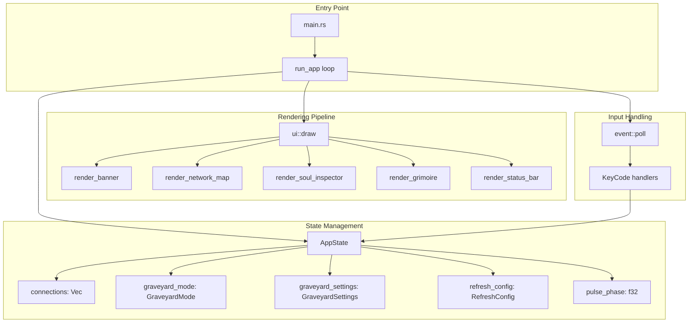
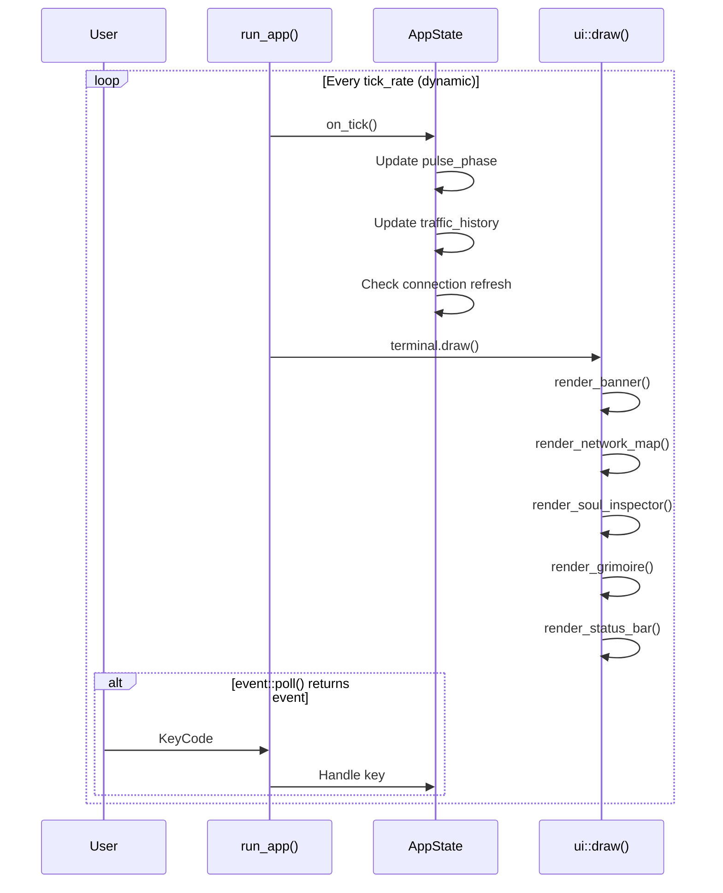
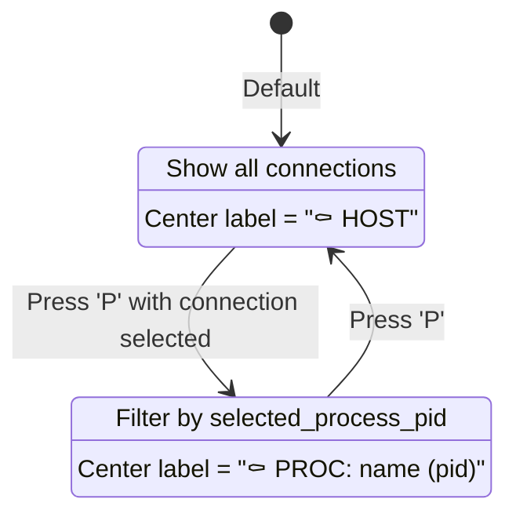

# Design Document: UI Skeleton

## Overview

ntomb UI Skeleton은 Ratatui 프레임워크를 사용하여 터미널 기반 네트워크 시각화 인터페이스를 구현합니다. 이 문서는 레이아웃 시스템, 좌표계, 노드 배치 알고리즘, 도메인 데이터와 UI 요소 간의 매핑, 인터랙션 플로우를 설명합니다.

핵심 설계 원칙:
1. **Clarity Over Decoration**: 상태 정보가 장식보다 우선
2. **Status-First Color Encoding**: 색상은 항상 상태를 먼저 인코딩
3. **Accessible by Default**: 모든 효과는 토글 가능, 가독성 필수

## Architecture



## Components and Interfaces

### 1. Main Layout System (src/ui.rs)

```rust
/// Main UI drawing function
pub fn draw(f: &mut Frame, app: &mut AppState) {
    let size = f.area();

    // 3-tier vertical layout
    let chunks = Layout::default()
        .direction(Direction::Vertical)
        .constraints([
            Constraint::Length(8),  // Banner (fixed 8 lines)
            Constraint::Min(0),     // Body (flexible)
            Constraint::Length(3),  // Status bar (fixed 3 lines)
        ])
        .split(size);

    // Body: horizontal split
    let body_chunks = Layout::default()
        .direction(Direction::Horizontal)
        .constraints([
            Constraint::Percentage(65), // Network map (left)
            Constraint::Percentage(35), // Right panels
        ])
        .split(chunks[1]);

    // Right side: vertical split
    let right_chunks = Layout::default()
        .direction(Direction::Vertical)
        .constraints([
            Constraint::Percentage(60), // Soul Inspector
            Constraint::Percentage(40), // Grimoire
        ])
        .split(body_chunks[1]);
}
```

### 2. Coordinate System & Canvas

Graveyard는 0-100 가상 좌표계를 사용하는 Canvas 위젯입니다:

```
        Canvas: 0-100 virtual space
        
              (50, 90) - Top
                 │
    ┌────────────┼────────────┐
    │            │            │
    │   ┌────────┼────────┐   │  Outer Ring (r=35)
    │   │  ┌─────┼─────┐  │   │
    │   │  │     │     │  │   │  Middle Ring (r=25)
(0,50)──┼──┼─────●─────┼──┼───(100,50)
    │   │  │   HOST    │  │   │  Inner Ring (r=15)
    │   │  │  (50,50)  │  │   │
    │   │  └───────────┘  │   │
    │   └─────────────────┘   │
    │                         │
    └─────────────────────────┘
              (50, 10) - Bottom
```

**핵심 상수:**
```rust
// Ring radii for latency-based positioning
const RING_RADII: [f64; 3] = [15.0, 25.0, 35.0];

// Center point of HOST node
const HOST_CENTER: (f64, f64) = (50.0, 50.0);

// Maximum visible endpoints
const MAX_NODES: usize = 12;
```

### 3. EndpointNode Structure

```rust
/// Endpoint node for canvas rendering
pub struct EndpointNode {
    /// Display label (shortened IP address)
    pub label: String,
    /// X coordinate on canvas (0-100 virtual space)
    pub x: f64,
    /// Y coordinate on canvas (0-100 virtual space)
    pub y: f64,
    /// Dominant connection state for this endpoint
    pub state: ConnectionState,
    /// Number of connections to this endpoint
    pub conn_count: usize,
    /// Latency bucket for ring positioning
    pub latency_bucket: LatencyBucket,
}
```

### 4. GraveyardSettings (src/app.rs)

```rust
/// Visual settings for the Graveyard panel
#[derive(Debug, Clone)]
pub struct GraveyardSettings {
    /// Enable particle animations on edges
    pub animations_enabled: bool,
    /// Show text labels on endpoints
    pub labels_enabled: bool,
    /// Enable Kiroween Overdrive theme
    pub overdrive_enabled: bool,
}
```

## Data Models

### Connection → UI Element Mapping

| Domain Data | UI Element | Visual Representation |
|-------------|------------|----------------------|
| Connection.state | Node icon | 🎃/👻/💀/⏳/👂/🌐 |
| Connection.state | Edge color | Green/Orange/Yellow/Red |
| Connection.remote_addr | Node label | Shortened IP (max 15 chars) |
| Connection.pid/process_name | Grimoire tag | [name(pid)] |
| LatencyBucket | Ring position | Inner/Middle/Outer ring |

### ConnectionState → Visual Mapping

| State | Icon | Color | Ring Default |
|-------|------|-------|--------------|
| Established | 🎃 | Toxic Green | Middle |
| TimeWait | 👻 | Pumpkin Orange | Outer |
| CloseWait | 💀 | Pumpkin Orange | Outer |
| SynSent | ⏳ | Yellow | Middle |
| Listen | 👂 | Bone White | Inner |
| Close | 🌐 | Blood Red | Outer |
| Unknown | 🌐 | Bone White | Middle |

### Color Palette Constants

```rust
// From visual-design.md steering document
const NEON_PURPLE: Color = Color::Rgb(187, 154, 247);   // #bb9af7
const PUMPKIN_ORANGE: Color = Color::Rgb(255, 158, 100); // #ff9e64
const BLOOD_RED: Color = Color::Rgb(247, 118, 142);      // #f7768e
const TOXIC_GREEN: Color = Color::Rgb(158, 206, 106);    // #9ece6a
const BONE_WHITE: Color = Color::Rgb(169, 177, 214);     // #a9b1d6
const DEEP_INDIGO: Color = Color::Rgb(47, 51, 77);       // #2f334d (selection bg)
```

## Classic Coffin Rendering System

### 관(Coffin) 템플릿 정의

ntomb의 핵심 시각 요소인 중앙 HOST 관은 다음 3가지 변형을 지원합니다:

#### 1. Full 5-Line Coffin (기본)

```text
  /‾‾‾‾‾‾\      <- Line 0: 상단 뚜껑 (2칸 들여쓰기)
 /  ⚰️    \     <- Line 1: 상단 확장 (1칸 들여쓰기, 아이콘)
/   HOST   \    <- Line 2: 본체 (0칸 들여쓰기, 이름)
 \        /     <- Line 3: 하단 수축 (1칸 들여쓰기)
  \______/      <- Line 4: 하단 바닥 (2칸 들여쓰기)
```

**구조 규칙:**
- 최대 폭: `name_len + 6` (양쪽 슬래시 + 패딩)
- 높이: 5줄 고정
- 대칭: Line 0 ↔ Line 4, Line 1 ↔ Line 3

#### 2. Compact 3-Line Coffin (공간 부족 시)

```text
 /‾‾‾‾‾‾\       <- Line 0: 상단
 | ⚰ HOST |     <- Line 1: 본체 (아이콘 + 이름)
 \______/       <- Line 2: 하단
```

**구조 규칙:**
- 최대 폭: `name_len + 6`
- 높이: 3줄 고정

#### 3. Label Only (최소 공간)

```text
[⚰ HOST]
```

**구조 규칙:**
- 폭: `name_len + 4` (괄호 + 아이콘 + 공백)
- 높이: 1줄

### CoffinRender 구조체

```rust
/// 관 렌더링 결과를 담는 구조체
pub struct CoffinRender {
    /// 관을 구성하는 각 줄 (위에서 아래로)
    pub lines: Vec<String>,
    /// 사용된 관 변형 종류
    pub variant: CoffinVariant,
    /// 관의 최대 폭 (문자 수)
    pub width: usize,
    /// 관의 높이 (줄 수)
    pub height: usize,
}

/// 관 변형 종류
pub enum CoffinVariant {
    /// 5줄 전체 관
    Full5Lines,
    /// 3줄 컴팩트 관
    Compact3Lines,
    /// 1줄 라벨만
    LabelOnly,
}
```

### build_coffin_block 함수

```rust
/// Graveyard 중앙 HOST 관 블록을 생성한다.
/// 
/// # Arguments
/// * `host_name` - 표시할 호스트/프로세스 이름
/// * `area_width` - Graveyard 패널의 가로 크기 (캔버스 유닛)
/// * `area_height` - Graveyard 패널의 세로 크기 (캔버스 유닛)
/// 
/// # Returns
/// CoffinRender 구조체 (관 라인들과 메타데이터)
/// 
/// # Algorithm
/// 1. 호스트 이름 길이 확인 및 필요시 truncate
/// 2. 5줄 관이 들어갈 수 있는지 확인
/// 3. 불가능하면 3줄 관 시도
/// 4. 그래도 불가능하면 1줄 라벨로 fallback
pub fn build_coffin_block(
    host_name: &str,
    area_width: f64,
    area_height: f64,
) -> CoffinRender
```

### 호스트 이름 처리 규칙

1. **최대 길이**: 12자 (관 내부 폭 기준)
2. **Truncation**: 12자 초과 시 `name[..9] + "..."`
3. **중앙 정렬**: 관 본체 라인에서 이름을 중앙에 배치

### Graceful Degradation 전략

```
┌─────────────────────────────────────────────────────┐
│ area_height >= 10 && area_width >= 20               │
│ → Full 5-Line Coffin                                │
├─────────────────────────────────────────────────────┤
│ area_height >= 6 && area_width >= 16                │
│ → Compact 3-Line Coffin                             │
├─────────────────────────────────────────────────────┤
│ area_width >= 10                                    │
│ → Label Only [⚰ HOST]                               │
├─────────────────────────────────────────────────────┤
│ Otherwise                                           │
│ → 빈 CoffinRender (렌더링 불가)                      │
└─────────────────────────────────────────────────────┘
```

### 관 주변 여백 (Exclusion Zone)

관 주변에는 다른 노드/선이 침범하지 않도록 여백을 확보합니다:

```
     ┌───────────────────┐
     │   Exclusion Zone  │
     │  ┌─────────────┐  │
     │  │   COFFIN    │  │
     │  └─────────────┘  │
     │                   │
     └───────────────────┘
```

- **수평 여백**: 관 폭의 1.5배
- **수직 여백**: 관 높이의 1.2배
- `coffin_radius` 상수로 제어 (현재 15.0 캔버스 유닛)

## Node Placement Algorithm

### 1. Endpoint Aggregation

```rust
// Group connections by remote IP
let mut endpoints_map: HashMap<String, Vec<&Connection>> = HashMap::new();
for conn in &filtered_connections {
    if conn.state != ConnectionState::Listen && conn.remote_addr != "0.0.0.0" {
        endpoints_map.entry(conn.remote_addr.clone()).or_default().push(conn);
    }
}

// Sort by connection count (descending)
let mut sorted_endpoints: Vec<_> = endpoints_map.iter().collect();
sorted_endpoints.sort_by(|a, b| b.1.len().cmp(&a.1.len()));

// Limit to MAX_NODES
let visible_endpoints = sorted_endpoints.iter().take(MAX_NODES);
```

### 2. Latency Bucket Classification

```rust
pub fn classify_latency(latency_ms: Option<u64>, config: &LatencyConfig) -> LatencyBucket {
    match latency_ms {
        None => LatencyBucket::Unknown,
        Some(ms) => {
            if ms < config.low_threshold_ms {      // < 50ms
                LatencyBucket::Low
            } else if ms <= config.high_threshold_ms { // 50-200ms
                LatencyBucket::Medium
            } else {                                // > 200ms
                LatencyBucket::High
            }
        }
    }
}
```

### 3. Position Calculation

```rust
pub fn calculate_endpoint_position(
    endpoint_idx: usize,
    total_in_bucket: usize,
    latency_bucket: LatencyBucket,
) -> (f64, f64) {
    let (cx, cy) = HOST_CENTER; // (50.0, 50.0)
    
    // Select ring radius based on latency bucket
    let radius = match latency_bucket {
        LatencyBucket::Low => RING_RADII[0],      // 15.0
        LatencyBucket::Medium => RING_RADII[1],   // 25.0
        LatencyBucket::High => RING_RADII[2],     // 35.0
        LatencyBucket::Unknown => RING_RADII[1],  // 25.0 (fallback)
    };
    
    // Distribute evenly around ring (start from top, clockwise)
    let total = total_in_bucket.max(1) as f64;
    let angle = (endpoint_idx as f64 / total) * 2.0 * PI - PI / 2.0;
    
    // Add jitter to prevent overlap
    let jitter = ((endpoint_idx % 3) as f64 - 1.0) * 2.0;
    let effective_radius = radius + jitter;
    
    let x = cx + effective_radius * angle.cos();
    let y = cy + effective_radius * angle.sin();
    
    (x.clamp(5.0, 95.0), y.clamp(5.0, 95.0))
}
```

## Interaction Flow

### 1. Main Event Loop



### 2. Key Binding Flow

```rust
// src/main.rs - handle_key_event
match key.code {
    // Navigation
    KeyCode::Up => app.select_previous_connection(),
    KeyCode::Down => app.select_next_connection(),
    
    // Mode switching
    KeyCode::Char('p') | KeyCode::Char('P') => app.toggle_graveyard_mode(),
    
    // Refresh rate
    KeyCode::Char('+') | KeyCode::Char('=') => app.increase_refresh_rate(),
    KeyCode::Char('-') | KeyCode::Char('_') => app.decrease_refresh_rate(),
    
    // Visual toggles
    KeyCode::Char('a') | KeyCode::Char('A') => toggle animations,
    KeyCode::Char('h') | KeyCode::Char('H') => toggle overdrive,
    KeyCode::Char('t') | KeyCode::Char('T') => toggle labels,
    
    // Exit
    KeyCode::Char('q') | KeyCode::Char('Q') | KeyCode::Esc => app.running = false,
}
```

### 3. GraveyardMode Toggle



## Animation System

### Pulse Phase Animation

```rust
// AppState::on_tick()
const TICK_INTERVAL_MS: u128 = 100;

if elapsed_tick >= TICK_INTERVAL_MS {
    self.pulse_phase += 0.05;
    if self.pulse_phase >= 1.0 {
        self.pulse_phase = 0.0;
    }
}
```

### Color Interpolation

```rust
fn interpolate_color(color1: (u8, u8, u8), color2: (u8, u8, u8), ratio: f32) -> Color {
    let ratio = ratio.clamp(0.0, 1.0);
    let r = (color1.0 as f32 + (color2.0 as f32 - color1.0 as f32) * ratio) as u8;
    let g = (color1.1 as f32 + (color2.1 as f32 - color1.1 as f32) * ratio) as u8;
    let b = (color1.2 as f32 + (color2.2 as f32 - color1.2 as f32) * ratio) as u8;
    Color::Rgb(r, g, b)
}

// Usage: pulse between Neon Purple and lighter shade
let pulse_color = interpolate_color((138, 43, 226), (187, 154, 247), app.pulse_phase);
```

### Zombie Blink Animation

```rust
const BLINK_INTERVAL_MS: u128 = 500;

if elapsed_blink >= BLINK_INTERVAL_MS {
    self.zombie_blink = !self.zombie_blink;
}
```

## Integration with Other Specs

### ntomb-core

- `Connection` 구조체와 `ConnectionState` enum 사용
- `collect_connections()` 함수로 데이터 수집

### process-focus

- `GraveyardMode` enum (Host/Process)
- `selected_process_pid` 필드
- `toggle_graveyard_mode()` 메서드

### configurable-refresh

- `RefreshConfig` 구조체
- `increase_refresh_rate()` / `decrease_refresh_rate()` 메서드
- Dynamic `tick_rate` in event loop

### ntomb-graveyard-vfx

- `GraveyardSettings` 구조체 (animations, labels, overdrive)
- `LatencyConfig` 및 `LatencyBucket`
- Latency ring rendering

## Error Handling

| Situation | Handling |
|-----------|----------|
| No connections | Display "The graveyard is quiet..." message |
| Process mode with no matching connections | Display "(no active connections for this process)" |
| Too many endpoints (> 12) | Show top 12 + "+N more" indicator |
| Terminal too narrow | Truncate status bar hints by priority |
| Connection refresh failure | Keep existing connections, set conn_error message |

## Performance Considerations

### Rendering Optimization

- Canvas uses Braille markers for efficient terminal rendering
- Endpoint limit (MAX_NODES = 12) prevents overcrowding
- Conditional ring rendering (only when latency data exists)

### Refresh Rate Bounds

```rust
const MIN_REFRESH_MS: u64 = 50;   // Maximum 20 FPS
const MAX_REFRESH_MS: u64 = 1000; // Minimum 1 FPS
const REFRESH_STEP: u64 = 50;     // Adjustment step
const DATA_REFRESH_MULTIPLIER: u64 = 10; // Data refreshes 10x slower than UI
```

### Memory Usage

- Traffic history: Fixed 60 samples (Vec<u64>)
- Connection list: Dynamic, refreshed periodically
- No persistent state beyond current session

## Testing Strategy

### Unit Tests

1. `classify_latency()` - Threshold boundary testing
2. `calculate_endpoint_position()` - Position calculation accuracy
3. `interpolate_color()` - Color interpolation correctness
4. `particle_position()` - Animation math verification

### Integration Tests

1. Layout proportions at various terminal sizes
2. Mode toggle state transitions
3. Refresh rate bounds enforcement

### Manual Testing

1. Visual inspection of all UI components
2. Animation smoothness at different refresh rates
3. Readability with effects disabled
4. Cross-platform (Linux, macOS) rendering

